<!-- _paginate: skip -->

# Proyecto Final
Luis Daniel Casais Mezquida

Análisis Inteligente de Datos 24/25
Universidad Carlos III de Madrid

---
## _Dataset_
[“Obesity Prediction Dataset”](https://www.kaggle.com/datasets/adeniranstephen/obesity-prediction-dataset), por Stephen Adeniran (2025)
- Estimar nivel de obesidad
- Hábitos alimenticios, físicos, y médicos
- México, Perú, y Colombia

---
<!-- header: '**Dataset**' -->

- 2112 observaciones
- 17 características
   - categóricas (5), numéricas (8), booleanas (4)
- 0 celdas vacías, 9 (33) duplicados (1.56%)

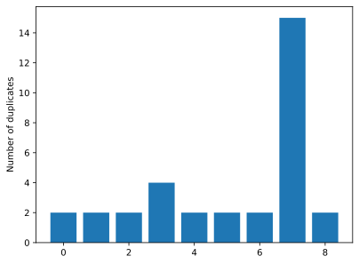

---

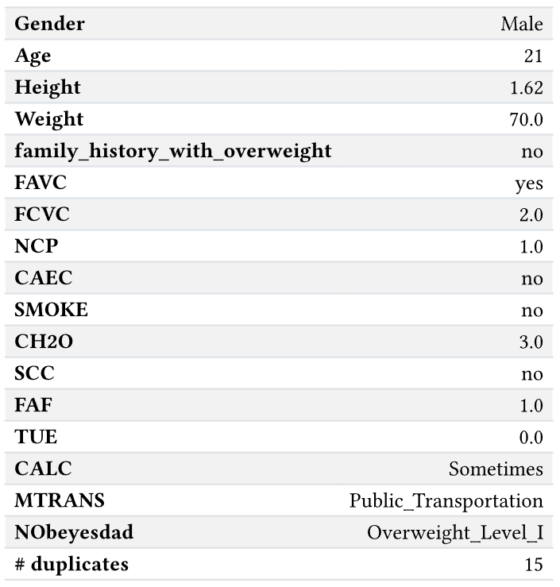

---

### Análisis univariable
- Características muy desbalanceadas (>80%): _SMOKE_, _family_history_with_overweight_
- Característica objetivo balanceada
- Características de rangos numéricos con "ruido"

---

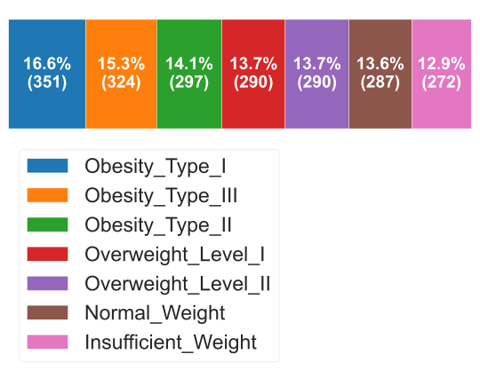
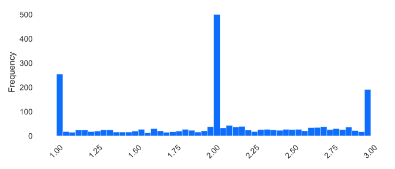

---
### Análisis multivariable
- Alta correlación entre género, peso, e historial familiar con obesidad
- Obesidad por género:
   - Tipo II: apenas mujeres
   - Tipo III: apenas hombres

--- 
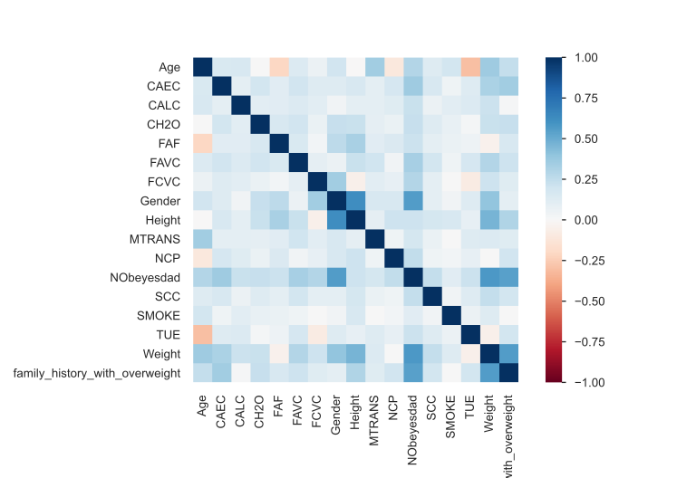

---

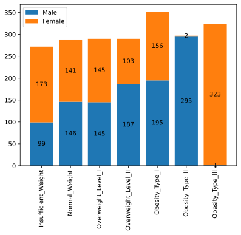

---
<!-- header: '' -->
## Metodología

Métrica de evaluación: F1-score, macro

Preprocesado:
1. Redondear rangos numéricos a entero
2. Escalado para variables numéricas
3. Encoding para categóricas

---
## Experimentación
- 20% test
- _Cross Validation_ de 5
- Ajuste hiperparámetros

---
Modelos:
1. Base
   - _Naive Bayes_
   - _K-Neighbours_
   - _SVM_
   - _Logistic Regression_
   - _Random Forest_
   - _XGBoost_
2. _Stacking_

---
<!-- header: '**Experimentación**' -->
### Modelos base
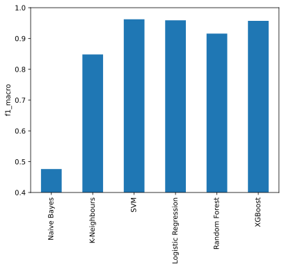

---
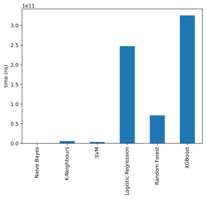

---
### _Stacking_
- _SVM_ + _Logistic Regression_ + _XGBoost_
- Usando mejores hiperparámetros de búsqueda anterior
- Estimador final: _Logistic Regression_

 

Modelo elegido.

---

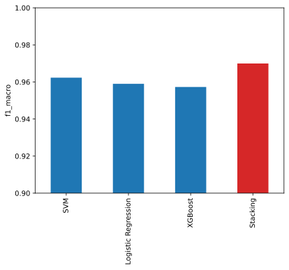

---
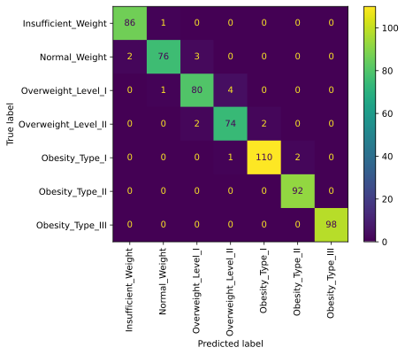

---
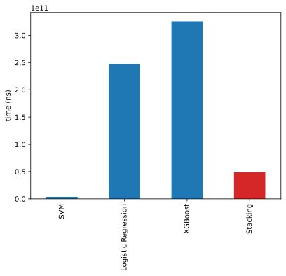

---

<!-- _paginate: skip -->

# _Gracias por su atención_